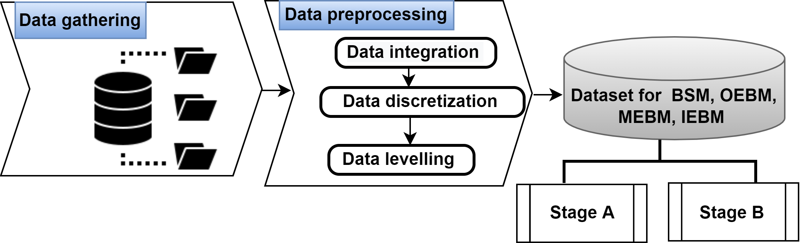
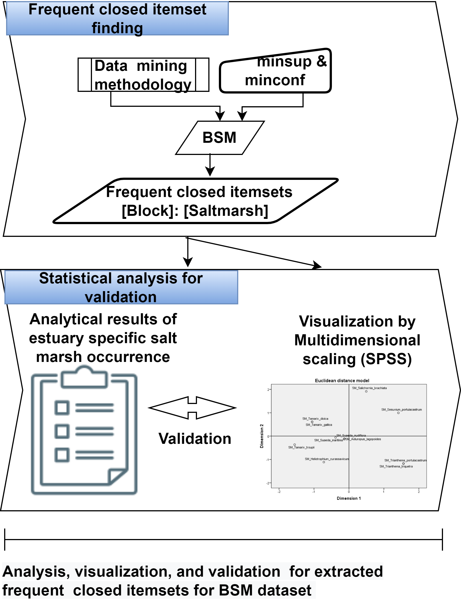
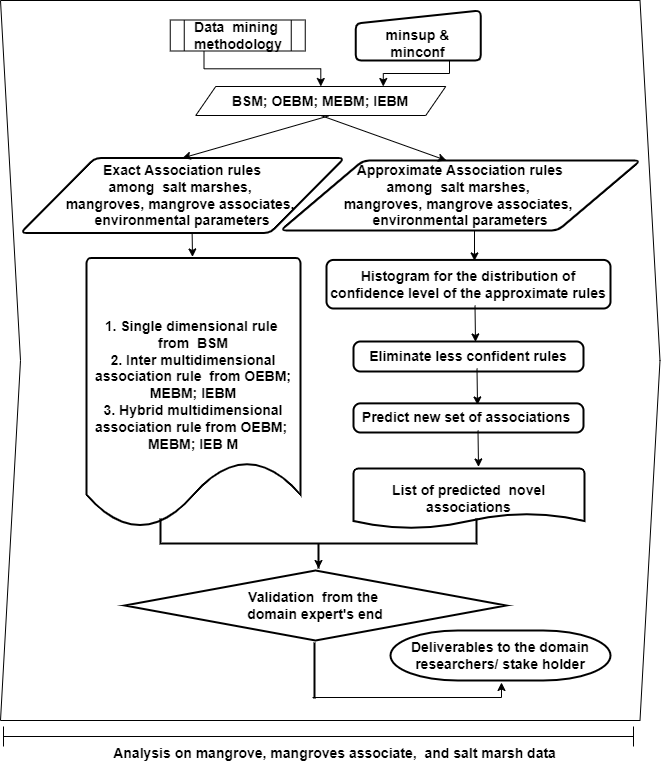

# Co-existence-Pattern-Recognition-SaltMarsh-and-Mangrove

This repository contains framework of an excessive salinity-affected mangrove community restoration approach where hypersalinity could be neutralized by growing suitable saltmarshes. Major contributions made here:

• Case study on Sundarban coastal area considering major environmental/habitat factors, such as salinity, pH, soil texture, tidal amplitude, along with the
occurrence data of mangroves, mangrove associates, and salt marshes and compile 3 different datasets for inner, middle, and outer estuarine species records.

• Establishing
– salt mash-salt marsh co-existence pattern along the salinity gradient
– salt marshes, mangroves, and mangrove associates co-existence patterns with varying environmental factors
– probable inter-species association from present co-existence data

Authors: Moumita Ghosh, Kartick Chandra Mondal, Anirban Roy

## Table of Contents

- [Introduction](#Introduction)
- [Data Description](#DataDescription)
- [Proposed Framework](#ProposedFramework)
- [Tools used](#ToolsUsed)
- [Sample Rules](#SampleRules)
- [References](#References)

## Introduction
Climate-change driven sea level rise causes a increase in salinity in coastal wetlands accelerating the alteration of the species composition. It triggers the gradual extinction of species, particularly the mangrove population which is intolerant
of excessive salinity. Thus despite being crucial to a wide range of ecosystem services, mangroves have been identified
as a vulnerable coastal biome. Hence restoration strategy of mangroves is undergoing rigorous research and experiments
in literature at an interdisciplinary level. From a data-driven perspective, analysis of mangrove occurrence data could
be the key to comprehend and predict mangrove behavior along different environmental parameters, and it could be
important in formulating management strategy for mangrove rehabilitation and restoration. As salt marshes are the
natural salt-accumulating halophytes, mitigating excessive salinity could be achieved by incorporating salt-marshes in
mangrove restoration activities. This study intends to find a novel restoration strategy by assessing the frequent co-
existence status of salt marshes, with the mangroves, and mangrove associates in different zones of degraded mangrove
patches for species-rich plantation. To achieve this, we primarily design a novel methodological framework for the
practice of knowledge discovery concerning the coexistence pattern of salt marshes, mangroves, and mangrove associates
along with environmental parameters using a data mining paradigm of association rule mining. The proposed approach
has the capability to uncover underlying facts and forecast likely facts that could automate the study in the field of
ecological research to comprehend the occurrence of inter-species relationships. Our findings are based on published data
gathered on the Sundarban Mangrove Forest, one of the world’s most important littoral forests. The existing literature
reinforces the findings that include all the sets of frequently co-occurring mangroves, their associates, and salt marshes
along the salinity gradient of coastal Sundarbans. A detailed understanding of the occurrence patterns of all these, along
with the environmental variables, would be able to promote decision-making strategy. This framework is effective for
both academia and stakeholders, especially the foresters/ conservation planners, to regulate the spread of salt marshes
and the restoration of mangroves as well

## Datasets description

The occurrence records of 11 salt marshes along all the blocks are summarized in \textit{BSM} (dataset of blocks versus salt marshes), where the rows represent the 22 blocks and the columns represent the 11 salt marshes.
Besides the salt marsh records, three more datasets have been generated for inner, middle, and outer estuarine blocks.
These three datasets are denoted as OEBM, MEBM, and IEBM (dataset of outer estuarine blocks, middle estuarine blocks, and, inner estuarine blocks, respectively) where each of these contains the presence record of the estuary-specific distinct salt marshes, mangroves, and mangrove associates data, and other environmental parameters (such as salinity, pH, soil texture, and tidal amplitude) across the columns.
The rows represent the identified blocks for the outer, middle, and inner estuarine regions.

## Proposed Framework

The whole framework has been depicted in 3 parts. After data gathering and preprocessing, the next steps are summarised in Stage A and Stage B.

 <figcaption>The proposed framework</figcaption>

 <figcaption>Stage A of the proposed framework</figcaption>
 

 

  <figcaption>Stage B of the proposed framework</figcaption>
 

## Tools used

- FIST: Tool for association rule mining and biclustering [1]
- SPSS: Statistical tool for multidimensional scaling

## Sample rules

1. Rule for presence association among the salt marshes (example of single dimensional association rule).

[Presence Tamarix dioica = 1] ⇒
[Presence {Tamarix gallica = 1, Tamarix troupii = 1, Suaeda maritima = 1}]
with support = 10, confidence = 1

2. Rule for salt marsh association with mangrove and mangrove associates (example of inter multidimensional association
rule for Suaeda maritima).

[Salt Marsh Suaeda maritima = Present] ⇒
[Salinity = Brackish water, pH = Moderately alkaline, Soil texture = Clay loam, Tidal height = Moderate,
Mangrove {Avicennia officinalis = Abundant, Aglaia cuculata = Occasional, Bruguiera gymnorhiza = Abundant, Bruguiera sexangula = Frequent,
Excoecaria agallocha = Abundant, Heriatiera fomes = Abundant, Phoenix paludosa = Abundant, Nypa fruticans = Frequent, Sonneratia apetala =
Abundant, Sonneratia caseolaris = Frequent, Xylocarpus mekongensis = Frequent}
Mangrove Associate {Acanthus ilicifolius = Frequnet, Brownlowia tersa = Frequent, Cerbera odollam = Occasional, Clerodendrum inerme =
Abundant, Crinum defixum = Abundant, Cyperus exaltatus = Rare, Cynometra ramiflora = Frequent, Derris trifoliata = Abundant, Fimbristylis
ferruginea = Rare, Intsia bijuga = Occasional, Myriostachya wightiana = Frequent, Pentatropis capensis = Abundant, Porteresia coarctata =
Abundant, Scirpus littoralis = Rare }]
with support = 8, confidence = 1

3. Rule for mangrove association with salt marsh and other mangroves (example of hybrid multidimensional association rule
for Sonneratia griffithii).

[Mangrove Sonneratia griffithii = Abundant] ⇒
[Salt Marsh Aeluropus lagopoides = Present,
Salinity in TDS (g/L)= Sea water, pH = Slightly alkaline, Soil texture = Silt Loam, Tidal height = Maximum,
Mangrove {Bruguiera cylindrica = Abundant, Bruguiera parviflora = Abundant, Ceriops tagal = Abundant, Avicennia alba = Abundant, Avicennia
marina = Abundant, Phoenix paludosa = Abundant, Aegialitis rotundifolia = Abundant, Excoecaria agallocha = Abundant}]

4.  Co-existence pattern of Heritiera fomes (Endangered species) with salt marshes and other rare/ frequent/ abundant mangroves/ mangrove associates and influencing environmental factors:

[Mangrove Heritiera fomes = Abundant] ⇒
[Salt Marsh Suaeda maritima = Present,
Salinity = Brackish water, pH = Moderately alkaline, Soil texture = Clay loam, Tidal height = Moderate,
Mangrove {Avicennia officinalis = Abundant, Aglaia cuculata = Occasional, Bruguiera gymnorrhiza = Abundant, Bruguiera sexangula = Frequent,
Cynometra ramiflora = Frequent, Excoecaria agallocha = Abundant, Nypa fruticans = Frequent, Phoenix paludosa = Abundant, Sonneratia apetala
= Abundant, Sonneratia caseolaris = Frequent, Xylocarpus mekongensis = Frequent}
Mangrove Associate {Acanthus ilicifolius = Frequent, Brownlowia tersa = Frequent, Cerbera odollam = Occasional, Clerodendrum inerme =
Abundant, Crinum defixum = Abundant, Cyperus exaltatus = Rare, Derris trifoliata = Abundant, Fimbristylis ferruginea = Rare, Intsia bijuga =
Occasional, Myriostachya wightiana = Frequent, Pentatropis capensis = Abundant, Porteresia coarctata = Abundant, Sarcolobus globosus =
Abundant, Scirpus littoralis = Rare}]
support = 7, confidence = 1

5. Co-existence status of Brownlowia tersa, (Near Threatened) with salt marshes and other rare/ frequent/ abundant mangroves/ associates and influencing environmental factors:
   
[Mangrove Brownlowia tersa = Frequent] ⇒
[SaltMarsh Suaeda maritima = Present,
Salinity = Brackish water, pH = Moderately alkaline, Soil texture = Clay loam, Tidal height = Moderate,
Mangrove {Avicennia officinalis = Abundant, Aglaia cuculata = Occasional, Bruguiera gymnorrhiza = Abundant, Bruguiera sexangula = Frequent,
Clerodendrum inerme = Abundant, Heriatiera fomes = Abundant, Intsia bijuga = Occasional, Nypa fruticans = Frequent, Phoenix paludosa =
Abundant, Sonneratia apetala = Abundant, Sonneratia caseolaris = Frequent, Xylocarpus mekongensis = Frequent},
Mangrove Associate {Acanthus ilicifolius = Frequent, Cerbera odollam = Occasional, Crinum defixum = Abundant, Cynometra ramiflora =
Frequent, Cyperus exaltatus = Rare, Derris trifoliata = Abundant, Excoecaria agallocha = Abundant, Fimbristylis ferruginea = Rare, Myriostachya
wightiana = Frequent, Pentatropis capensis = Abundant, Porteresia coarctata = Abundant, Sarcolobus globosus = Abundant, Scirpus littoralis =
Rare}]
support = 7, confidence = 1

6.  Co-existence status of Phoenix paludosa (Near Threatened) with salt marshes and other rare/ frequent/ abundant mangroves/ associates and influencing environmental factors:
   
[Mangrove Phoenix paludosa = Abundant] ⇒
[Salt marsh Suaeda maritima = Present,
Salinity = Brackish water, pH = Moderately alkaline, Soil texture = Clay loam, Tidal height = Moderate,
Mangrove {Avicennia officinalis = Abundant, Scirpus littoralis = Rare, Sonneratia caseolaris = Frequent, Xylocarpus mekongensis = Frequent],
Nypa fruticans = Frequent, Aglaia cuculata = Occasional, Bruguiera gymnorrhiza = Abundant, Bruguiera sexangula = Frequent, Heriatiera fomes =
Abundant, Sonneratia apetala = Abundant},
Mangrove Associate {Acanthus ilicifolius = Frequent, Brownlowia tersa = Frequent, Cerbera odollam = Occasional, Clerodendrum inerme =
Abundant, Crinum defixum = Abundant, Cyperus exaltatus = Rare, Cynometra ramiflora = Frequent, Derris trifoliata = Abundant, Fimbristylis
ferruginea = Rare, Intsia bijuga = Occasional, Myriostachya wightiana = Frequent, Pentatropis capensis = Abundant, Porteresia coarctata =
Abundant, Sarcolobus globosus = Abundant}],
support = 8, confidence = 1

7. Co-existence pattern of Ceriops decandra (Near Threatened) with salt marshes and other rare/ frequent/ abundant mangroves/ associates and influencing environmental factors:
   
[Mangrove Ceriops decandra = Abundant]
Salinity in TDS (g/L) = Salt water, pH = Moderately alkaline, Soil texture = Clay, Tidal height = Higher,
Mangrove {Raizophora apiculata = Abundant, Raizophora mucronata = Abundant, Kandelia candel = Abundant, Aegiceras corniculatum =
Abundant, Xylocarpus mekongensis = Abundant, Xylocarpus granatum = Abundant, Bruguiera gymnorhiza = Abundant, Excoecaria agallocha =
Abundant, Avicennia officinalis = Abundant, Avicennia alba = Abundant, Phoenix paludosa = Abundant},
Mangrove Associate {Finlaysonia obovata = Frequent, Derris scandens = Occasional, Tylophora tenuis = Rare, Sarcolobus globosus = Abundant,
Acanthus volubilis = Occasional}],
support = 7, confidence = 1

## References 
[1]Mondal, K.C., Pasquier, N., Mukhopadhyay, A., Maulik, U., Bandhopadyay, S., 2012. A new approach for association rule mining and bi-clustering using formal concept analysis. In: International Workshop on Machine Learning and Data Mining in Pattern Recognition. Springer, pp. 86–101

## ORIGINAL PAPER
**Moumita Ghosh, Kartick Chandra Mondal, Anirban Roy** - *Recognition of co-existence pattern of salt marshes and mangroves for littoral forest restoration* - [Link To Paper (https://www.sciencedirect.com/science/article/abs/pii/S1574954122002199#:~:text=Both%20positive%20and%20negative%20interactions,than%20at%20succulent%20saltmarsh%20species.)
